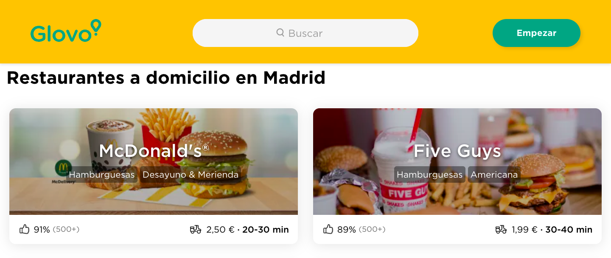

#

>## **SELENIUM GLOVO**

#####  
# 

>### **GOAL**

#### You've been recently hired by a new company as Data Analytics. 
- #### Your boss asked you to get data from the competitors website and analyze it.

- #### He wants you to get the most relevant data and extract some insights from it.
#

>### **PROCESS**

#### I will use Selenium to interact thorugh the competitor website. We aim to understand the offer that Glovo show per zone, filtering by:
- #### Category
- #### Likes
- #### Nº of likes
- #### Delivery fee
- #### Estimated time of arrival

#### All this information, will help us decide which category has room of improvement per zone on the delivery area
#### Once we have this information, we will be able to decide where and which type of food we need to launch
#

>### **CONCLUSIONS**

#### After analyzing the offer of Glovo we conclude that we need to launch  dark-kitchens of:
- #### Italian
- #### Mexican
- #### Poke
- #### 
- #### 

>### **LIBRARIES**

- #### [Selenium](https://selenium-python.readthedocs.io/)
- #### [Webdriver](https://selenium-python.readthedocs.io/api.html)
- #### [Time](https://docs.python.org/3/library/time.html)
- #### [Sys](https://docs.python.org/3/library/sys.html)
- #### [Requests](https://pypi.org/project/requests/2.7.0/)
- #### [Pandas](https://pandas.pydata.org/)
- #### [Dotenv](https://pypi.org/project/python-dotenv/)
- #### [Pymongo](https://www.mongodb.com/2)
- #### [Json](https://docs.python.org/3/library/json.html)
- #### [Os](https://docs.python.org/3/library/os.html)
- #### [Geopandas](https://geopandas.org/)
- #### [Shapely](https://pypi.org/project/Shapely/)
- #### [Reduce](https://docs.python.org/3/library/functools.html)
- #### [Operator](https://docs.python.org/3/library/operator.html)
- #### [Import dumps](https://pymongo.readthedocs.io/en/stable/api/bson/json_util.html)
- #### [Re](https://docs.python.org/3/library/re.html)
